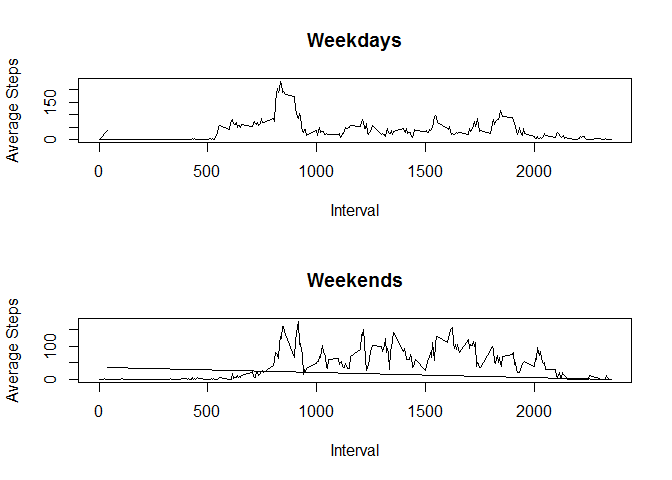

# Reproducible Research: Peer Assessment 1

=======================================================


## Loading and preprocessing the data

Assumes data is in the user's working directory. Uses the data.table package to read the csv file into the object, "steps_data"


```r
library(data.table)
```

```
## Warning: package 'data.table' was built under R version 3.1.3
```

```r
steps_data <- data.table(read.csv("activity.csv"))
```

Calculate the total number of steps for each day and produce a histogram.


```r
agg_steps <- as.data.frame(steps_data[,j=list(total_steps=sum(steps)),by=date])
hist(agg_steps$total_steps, xlab = "Total Steps", main = "Histogram of Daily Total Steps")
```

 

## What is mean total number of steps taken per day?

Caluculate mean and median values and display.


```r
mn <- round(mean(agg_steps$total_steps, na.rm=TRUE))
md <- median(agg_steps$total_steps, na.rm=TRUE)
```

* The mean number of total steps taken is 1.0766\times 10^{4}
* The median number of total steps taken is 10765


## What is the average daily activity pattern?

Calculate the average steps by five minute interval and plot a line graph.


```r
interval_steps <- as.data.frame(steps_data[,j=list(average_steps=mean(steps, na.rm=TRUE)),by=interval])
plot(interval_steps$interval, interval_steps$average_steps, type = "l", xlab = "Interval", ylab = "Average Steps")
```

 

Find out which period has the highest average step count.


```r
interval_steps[which.max(interval_steps$average_steps),]$interval
```

```
## [1] 835
```

8:35am has the highest average step count.

## Imputing missing values


```r
na_count <- sum(is.na(steps_data$steps))
```

The data set has 2304 NA values.

As a very basic first try, we shall replace all NAs with the average step count taken over all intervals measured.


```r
int_ave <- mean(steps_data$steps, na.rm = TRUE)
steps_data_imput <- steps_data
steps_data_imput[is.na(steps_data_imput$steps)] <- int_ave
```

Now plot a histogram showing both data sets.


```r
agg_steps_imput <- as.data.frame(steps_data_imput[,j=list(total_steps=sum(steps)),by=date])
hist(agg_steps_imput$total_steps, xlab = "Total Steps (NAs replaced)", main = "Histogram of Daily Total Steps (NAs replaced)")
```

 


```r
new_mn <- round(mean(agg_steps_imput$total_steps, na.rm=TRUE))
new_md <- median(agg_steps_imput$total_steps, na.rm=TRUE)
```

Imputing values in this fashion changes the mean from 1.0766\times 10^{4} to 1.2375\times 10^{4} and the median from 10765 to 11015.
Both statistics show reasonable increases after NA values have been replaced however no judgement is made here as to whether the change is statistically significant or the methodology sound.

## Are there differences in activity patterns between weekdays and weekends?

Add a column to the imputed dataframe to distinguish between weekdays and weekends.


```r
steps_data_imput$dayname <- weekdays(as.POSIXlt(steps_data$date))
```

Create two subsets of the data, one for weekdays and another for weekends.


```r
weekdays <- subset(steps_data_imput, dayname %in% c("Monday", "Tuesday", "Wednesday", "Thursday", "Friday"))
weekends <- subset(steps_data_imput, dayname %in% c("Saturday", "Sunday"))
```

Calculate average number of steps per five minute inteval for weekdays and weekends, then plot both datasets.


```r
wd_steps <- as.data.frame(weekdays[,j=list(average_steps=mean(steps, na.rm=TRUE)),by=interval])
we_steps <- as.data.frame(weekends[,j=list(average_steps=mean(steps, na.rm=TRUE)),by=interval])

par(mfrow = c(2,1))

plot(wd_steps$interval, wd_steps$average_steps, type = "l", xlab = "Interval", ylab = "Average Steps", main = "Weekdays")
plot(we_steps$interval, we_steps$average_steps, type = "l", xlab = "Interval", ylab = "Average Steps", main = "Weekends")
```

 

Weekend activity is sustained over the whole day, whereas weekday avtivity is more concentrated in the morning period, pre 10am.
